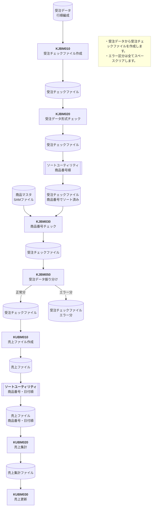

# KJJD010 受注データ更新 JOBフロー

## 1. 基本情報

| **システム名** | **サブシステム名** | **ジョブ名** |
| -------------- | ------------------ | ------------ |
| 研修 (ID: K) | 受注 (ID: KJ) | 受注データ更新 (ID: KJJD010) |

## 2. フロー概要

受注データをチェックして、正常分の受注チェックファイルから売上ファイルを作成し、商品売上マスタを更新します。

## 3. JOBフロー

## 4. 各処理プロセス概要

### 受注チェックファイル作成 (KJBM010)

* 受注データから受注チェックファイルを作成します。
* エラー区分は全てスペースクリアします。

### 受注データ形式チェック (KJBM020)

* 受注データの各項目のデータ形式（属性）をチェックします。
* エラーの項目は、該当するエラー区分をセットします。

### ソート (ユーティリティ)

* 商品番号でソートを行います。
### 商品番号チェック (KJBM030)

* 受注データの商品番号を商品マスタとマッチングしてチェックします。
* すでに商品番号のエラー区分がセットされているものは、チェック対象外とします。
* マッチした場合は商品名をセットし、アンマッチの場合は該当エラー区分をセットします。

### 受注データ振り分け (KJBM050)

* 受注チェックファイルを正常分とエラー分に振り分けます。
* エラー区分が全てスペースであれば正常分として扱います。

### 売上ファイル作成 (KUBM010)

* 前工程（KJBM050）でチェック済みの「受注データ 正常分」から、売上ファイルを作成します。

### ソート (ユーティリティ)

* 売上ファイルを、商品番号、受注日付の順にソートします。

### 売上集計 (KUBM020)

* 商品番号、受注年月単位で売上金額を集計します。

### 売上更新 (KUBM030)

* 売上集計ファイルの売上金額を、売上マスタの「売掛現在残高」と「売上金額」へ加算（更新）します。
