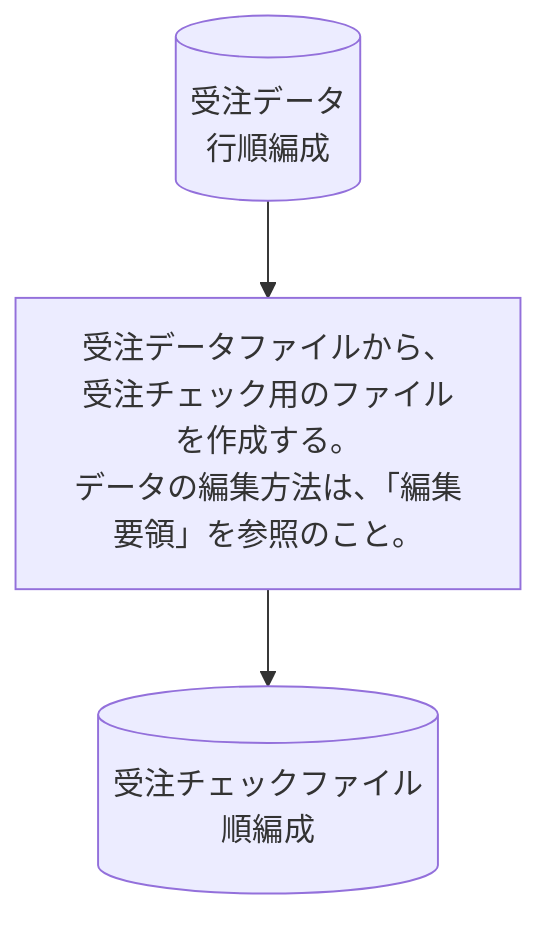

# KJBM010

## 1. 基本情報

| **システム名** | **サブシステム名** | **プログラム名** | **プログラムID** | **種別 / 形態** |
| -------------- | ------------------ | ---------------- | ---------------- | --------------- |
| 研修 (ID: K) | 受注 (ID: KJ) | 受注チェックファイル作成 | KJBM010 | MAIN / BAT |

## 2. プログラム概要

### 処理のポイント

* **数値項目の扱い**: 入力項目の数字項目にはエラーデータが含まれる可能性があるため、集団項目名を利用して「英数字項目」として転送する必要があります 。
* **事前処理**: レコード作成前に、予備項目をクリアする目的でレコード全体をスペースで初期化します 。

## 3. 入出力ファイル

| 区分         | アクセス名 | 論理ファイル名       | 構成 / 方法 | コピー句ID |
| ------------ | ---------- | -------------------- | --------------------- | ---------- |
| **入力 (I)** | ITF        | 受注データ           | 行順編成              | KJCF010    |
| **出力 (O)** | OTF        | 受注チェックファイル | 順編成                | KJCF020    |

## 4. 編集要領 

レコード全体を事前にスペースクリアした上で、以下の通り編集を行います 。

| 項番 | 項目名             | 編集内容 / 転送元                                      |
| ---- | ------------------ | ------------------------------------------------------ |
| 1    | データ区分         | ITFの同項目を転送                                      |
| 2    | 受注番号-X         | ITFの同項目を転送                                      |
| 3    | 受注日付           | 年上2桁に「0」をセット、以降6桁にITFの受注日付をセット |
| 4    | 商品番号-X         | ITFの同項目を転送                                      |
| 5    | 数量-X             | ITFの同項目を転送                                      |
| 6    | エラー区分テーブル | スペースをセット                                       |
| 7    | 商品名             | スペースをセット                                       |
| 8    | 単価               | ゼロをセット                                           |
| 9    | 金額               | ゼロをセット                                           |
