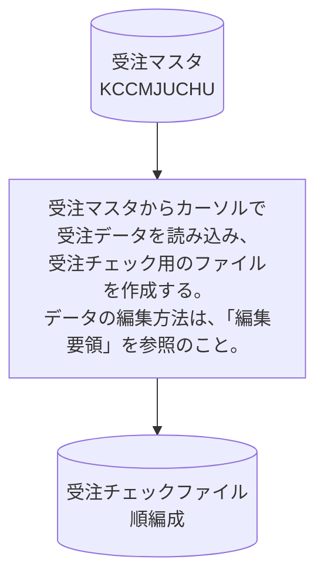

# KJBM011

## 1. 基本情報

| **システム名** | **サブシステム名** | **プログラム名** | **プログラムID** | **種別 / 形態** |
| -------------- | ------------------ | ---------------- | ---------------- | --------------- |
| 研修 (ID: K) | 受注 (ID: KJ) | 受注チェックファイル作成(DB入力版) | KJBM011 | MAIN / BAT |

## 2. プログラム概要

### 処理のポイント

* **DB接続**: 先頭で `CONNECT TO` により接続し、終了時に `DISCONNECT ALL` を実行します。接続文字列は `CONNSETTINGS=SET CLIENT_ENCODING to 'SJIS'` を含めて構築します 。
* **カーソル処理**: 受注マスタ (`KCCMJUCHU`) はカーソルを宣言して `OPEN` → `FETCH` ループ → `CLOSE` の順で読み込みます。`FETCH` 時の `SQLCODE` が `100` (データなし) になった時点でループを終了します 。
* **数値項目の扱い**: ホスト変数に受領したデータはエラー値を含む可能性があるため、出力レコード側の集団項目名を用いて「英数字項目」として転送します 。
* **事前処理**: レコード作成前に、予備項目をクリアする目的でレコード全体をスペースで初期化します 。
* **エラー処理**: SQLの致命的エラー発生時は `ERROR-RTN` を呼び、エラーメッセージ・`SQLCODE` をDISPLAYし、`RETURN-CODE` に `9` をセットして `STOP RUN` します 。

## 3. 入出力ファイル

| 区分         | アクセス名 | 論理ファイル名       | 構成 / 方法 | コピー句ID |
| ------------ | ---------- | -------------------- | ----------- | ---------- |
| **入力 (I)** | ―          | 受注マスタ           | DB (カーソル) | KCCMJUCHU  |
| **出力 (O)** | OTF        | 受注チェックファイル | 順編成      | KJCF020    |

## 4. 編集要領

レコード全体を事前にスペースクリアした上で、`FETCH` で取得した受注マスタの1行ごとに以下の通り編集を行います 。

| 項番 | 項目名             | 編集内容 / 転送元                                                             |
| ---- | ------------------ | ----------------------------------------------------------------------------- |
| 1    | データ区分         | 受注マスタの `CMJYUCHU_DATA_KBN` を転送                                       |
| 2    | 受注番号-X         | 受注マスタの `CMJYUCHU_JUCHU_NO` を転送                                       |
| 3    | 受注日付           | 年上2桁に「0」をセット、以降6桁に `CMJYUCHU_JUCHU_DATE` をセット              |
| 4    | 商品番号-X         | 受注マスタの `CMJYUCHU_SHOHIN_NO` を転送                                      |
| 5    | 数量-X             | 受注マスタの `CMJYUCHU_SURYO` を転送                                          |
| 6    | エラー区分テーブル | スペースをセット                                                              |
| 7    | 商品名             | スペースをセット                                                              |
| 8    | 単価               | ゼロをセット                                                                  |
| 9    | 金額               | ゼロをセット                                                                  |
