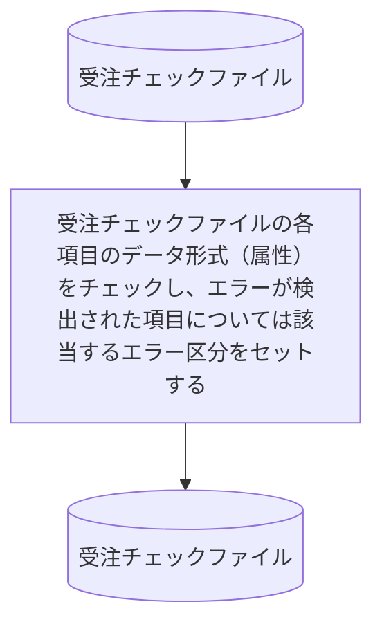

# KJBM020

## 1. 基本情報

| **システム名** | **サブシステム名** | **プログラム名** | **プログラムID** | **種別 / 形態** |
| -------------- | ------------------ | ---------------- | ---------------- | --------------- |
| 研修 (ID: K) | 受注 (ID: KJ) | 受注データ形式チェック | KJBM020 | MAIN / BAT |

## 2. プログラム概要

### 入出力ファイル

| 区分         | アクセス名 | 論理ファイル名       | 構成 / 方法 | コピー句ID |
| ------------ | ---------- | -------------------- | ----------- | ---------- |
| **入力 (I)** | ITF        | 受注チェックファイル | 順編成      | KJCF020    |
| **出力 (O)** | OTF        | 受注チェックファイル | 順編成      | KJCF020    |

### 使用サブプログラム

* **KCBS010**: 日付チェック用サブプログラム 

## 3. プログラム詳細

* 入力レコードの各項目のデータは、そのまま出力レコードの同項目に転記します。
* 下記チェック詳細に従い処理します。

### チェック詳細 (ITF各項目のチェック要領)

以下の各項目をチェックし、条件を満たさない場合は該当するエラー区分に **'1'** をセットします。

| 項番 | チェック項目   | チェック内容（正常条件）                                                     | 正常時の処理    | エラー時の処理                |
| ---- | -------------- | ---------------------------------------------------------------------------- | --------------- | ----------------------------- |
| (1)  | データ区分     | '1' または '9' であること                                                    | 処理なし        | エラー区分(1) に '1' を転記 |
| (2)  | 受注番号       | 数字であること、かつゼロでないこと                                           | 処理なし        | エラー区分(2) に '1' を転記 |
| (3)  | 受注日付       | **KCBS010**にてITFの受注日付（年上2桁は0）を西暦8桁として正常性を確認する。  | 受注日付にパラメータの西暦日付8桁を転記  | エラー区分(3) に '1' を転記 |
| (4)  | 商品番号       | 数字であること、かつゼロでないこと                                           | 処理なし        | エラー区分(5) に '1' を転記 |
| (5)  | 数量           | 数字であること、かつ **1 〜 999** の範囲内であること                         | 処理なし        | エラー区分(6) に '1' を転記 |

!!! note

    エラー区分(4)は未使用。必ずスペースが入っていること。 
