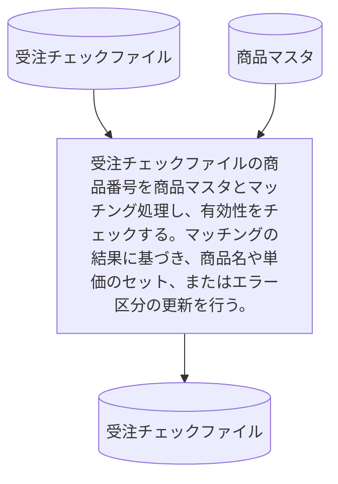

# KJBM030

## 1. 基本情報

| **システム名** | **サブシステム名** | **プログラム名** | **プログラムID** | **種別 / 形態** |
| -------------- | ------------------ | ---------------- | ---------------- | --------------- |
| 研修 (ID: K) | 受注 (ID: KJ) | 受注データ商品番号チェック | KJBM030 | MAIN / BAT |

## 2. プログラム概要

### 入出力ファイル

| 区分         | アクセス名 | 論理ファイル名       | 構成   | コピー句ID |
| ------------ | ---------- | -------------------- | ------ | ---------- |
| **入力 (I)** | ITF        | 受注チェックファイル | 順編成 | KJCF020    |
| **入力 (I)** | IMF        | 商品マスタ           | 順編成 | KCCFSHO    |
| **出力 (O)** | OTF        | 受注チェックファイル | 順編成 | KJCF020    |

**備考**: 入力（ITF）に対して同一の商品番号が複数件存在し得る「N対1」のマッチング処理となります 。

## 3. 処理詳細

### 3.1 チェック対象外レコードの処理

* 前工程（形式チェック等）で「エラー区分(5)：商品番号エラー」が既にセットされているレコード（スペース以外）は、マッチング対象外とします。
* これらのレコードは、内容を変更せずにそのままOTFへ出力します。

### 3.2 マッチング処理

ITF（受注チェックファイル）の商品番号と、IMF（商品マスタ）の商品番号をキーにして突合を行います 。

| 比較結果                   | 処理内容                                                                                                                                                                                                                       |
| -------------------------- | ------------------------------------------------------------------------------------------------------------------------------------------------------------------------------------------------------------------------------ |
| **ITF ＝ IMF** (マッチ) | 以下の項目をITFにセットし、OTFへ出力します。  1. **商品名**: IMFの商品名をセット   2. **単価**: IMFの単価をセット  3. **金額**: エラー区分(6)がスペース（数量正常）なら「ITF.数量 × IMF.単価」をセット、数量エラーなら「0」をセット |
| **ITF ＜ IMF** (不一致) | 商品マスタに存在しないため、以下の処理を行いOTFへ出力します 。  1. **エラー区分(5)** に **'2'** をセット                                                                                                                    |
| **ITF ＞ IMF**             | ITFおよびOTFへの処理は行わず、次のマスタ（IMF）を読み込みます 。                                                                                                                                                               |
