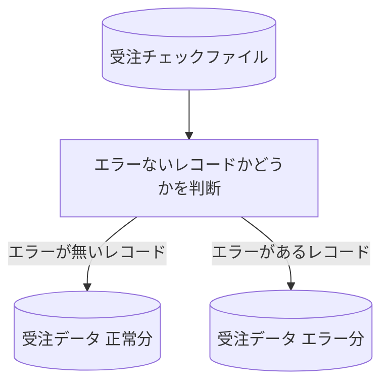

# KJBM050

## 1. 基本情報

| **システム名** | **サブシステム名** | **プログラム名** | **プログラムID** | **種別 / 形態** |
| -------------- | ------------------ | ---------------- | ---------------- | --------------- |
| 研修 (ID: K) | 受注 (ID: KJ) | 受注データ振り分け | KJBM050 | MAIN / BAT |

## 2. プログラム概要

受注チェックファイルを読み込み、レコード内のエラー区分の状態に応じて、正常分ファイルとエラー分ファイルのどちらか一方へ振り分け出力を行います 。

### 処理フロー図

### 入出力ファイル

| 区分         | アクセス名 | 論理ファイル名       | 構成 / 方法 | コピー句ID |
| ------------ | ---------- | -------------------- | ----------- | ---------- |
| **入力 (I)** | ITF        | 受注チェックファイル | 順編成      | KJCF020    |
| **出力 (O)** | OTF1       | 受注データ 正常分    | 順編成      | KJCF020    |
| **出力 (O)** | OTF2       | 受注データ エラー分  | 順編成      | KJCF020    |

## 3. 処理詳細

ITF（受注チェックファイル）の各レコードに対して以下の判定を行い、OTF1またはOTF2のいずれか一方にレコードをそのまま出力します 。

### 振り分け条件

#### **正常分への振り分け (OTF1)**
* 条件：**エラー区分テーブル ＝ スペース** の場合 
* 処理：ITFレコードをそのままOTF1（正常分）へ出力します 。
#### **エラー分への振り分け (OTF2)**
* 条件：**エラー区分テーブル ≠ スペース**（いずれかのエラー区分がセットされている）の場合 
* 処理：ITFレコードをそのままOTF2（エラー分）へ出力します 。
