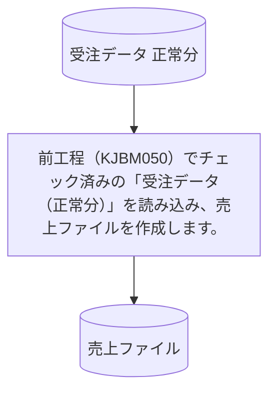

# KUBM010

## 1. 基本情報

| **システム名** | **サブシステム名** | **プログラム名** | **プログラムID** | **種別 / 形態** |
| -------------- | ------------------ | ---------------- | ---------------- | --------------- |
| 研修 (ID: K) | 売上 (ID: KU) | 売上ファイル作成 | KUBM010 | MAIN / BAT |

## 2. プログラム概要

### 入出力ファイル

| 区分         | アクセス名 | 論理ファイル名      | 構成 / 方法 | コピー句ID |
| ------------ | ---------- | ------------------- | ----------- | ---------- |
| **入力 (I)** | ITF        | 受注データ (正常分) | 順編成      | KJCF020    |
| **出力 (O)** | OTF        | 売上ファイル        | 順編成      | KUCF010    |

## 3. 編集要領 (売上ファイル)

レコード作成に際しては、予備項目をスペースで初期化するため、事前にレコード全体をスペースクリアします 。各項目の編集内容は以下の通りです。

| 項番 | 項目名       | 編集内容 / 転送元 |
| ---- | ------------ | ----------------- |
| 1    | データ区分   | ITFの同項目を転送 |
| 2    | 受注日付     | ITFの同項目を転送 |
| 3    | 受注番号     | ITFの同項目を転送 |
| 4    | 商品番号     | ITFの同項目を転送 |
| 5    | 商品名       | ITFの同項目を転送 |
| 6    | 単価         | ITFの同項目を転送 |
| 7    | 数量         | ITFの同項目を転送 |
| 8    | 金額         | ITFの同項目を転送 |
