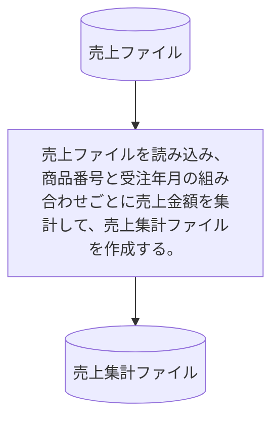

# KUBM020

## 1. 基本情報

| **システム名** | **サブシステム名** | **プログラム名** | **プログラムID** | **種別 / 形態** |
| -------------- | ------------------ | ---------------- | ---------------- | --------------- |
| 研修 (ID: K) | 売上 (ID: KU) | 売上集計 | KUBM020 | MAIN / BAT |

## 2. プログラム概要

### 入出力ファイル

| 区分         | アクセス名 | 論理ファイル名   | 構成 / 方法 | コピー句ID |
| ------------ | ---------- | ---------------- | ----------- | ---------- |
| **入力 (I)** | ITF        | 売上ファイル     | 順編成      | KUCF010    |
| **出力 (O)** | OTF        | 売上集計ファイル | 順編成      | KUCF020    |

## 3. 集計処理  

売上ファイル（ITF）の金額を、以下の要領で集計します 。

**集計キー**: 商品番号、受注年月。
**金額の集計方法**:

* データ区分が **'1'**の場合：ITFの金額をOTFの金額に**加算**する。
* データ区分が **'9'**の場合：ITFの金額をOTFの金額から**減算**する。

**その他の項目**: 集計項目（金額）以外の項目については、同一キー内の**先頭レコード**の値をセットします。

## 4. 編集要領 (売上集計ファイル)

予備項目をスペースにするため、事前にレコード全体をスペースクリアした上で編集を行います。

| 項番 | 項目名       | 編集内容 / 転送元                                        |
| ---- | ------------ | -------------------------------------------------------- |
| 1    | 商品番号     | 同一商品番号の先頭レコードからセット（ITFの同項目）      |
| 2    | 受注年月     | ITFの受注日付の年月をセット（同一キーの先頭レコードより）|
| 3    | 金額         | 上記「集計論理」に基づき、ITFの金額を集計してセット      |
