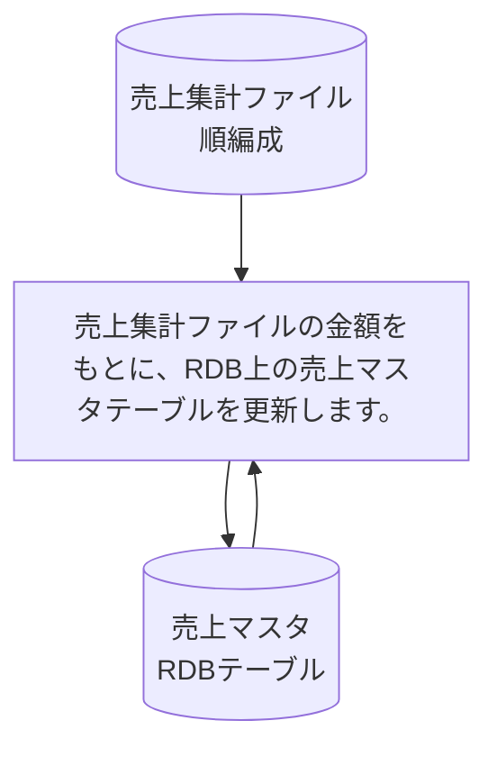

# KUBM030

## 1. 基本情報

| **システム名** | **サブシステム名** | **プログラム名** | **プログラムID** | **種別 / 形態** |
| -------------- | ------------------ | ---------------- | ---------------- | --------------- |
| 研修 (ID: K) | 売上 (ID: KU) | 売上更新 | KUBM030 | MAIN / BAT |

## 2. プログラム概要

### 入出力ファイル・テーブル

| 区分             | アクセス名 | 論理名           | 構成 / 方法 | コピー句ID    |
| ---------------- | ---------- | ---------------- | ----------- | ------------- |
| **入力 (I)**     | ITF        | 売上集計ファイル | 順編成      | KUCF020       |
| **入出力 (I/O)** | TBL        | 売上マスタ       | RDBテーブル | KCCMURIAGE    |

## 3. 処理詳細

### 3.1 売上マスタの検索

以下の条件を検索キーとして、売上マスタテーブル（TBL）を検索します。

* **検索条件**: `ITF.商品番号 = TBL.商品番号` かつ `ITF.受注年月 = TBL.売上年月` 

#### 検索エラー時の処理

該当するレコードが検索できなかった場合は、以下のコンソールメッセージを表示し、直ちにプログラムを異常終了（ABEND）させます。

* **メッセージ**: `!!! KUBM030 ABEND !!! SNO=XXXX, YM 999999, GAKU +999999999`
  ※SNO:商品番号、YM：受注年月、GAKU：金額

### 3.2 更新論理

検索に成功したレコードに対し、以下の更新を行います。

1.  **売掛現在残高の更新**: `ITF.金額` を `TBL.売掛現在残高` へ加算します 。
2.  **月別売上金額の更新**: `ITF.金額` を `TBL.売上金額` へ加算します 。

## 4. 編集要領 (売上マスタテーブル)

更新対象外の項目を含め、各項目の扱いは以下の通りです。

| 項番 | 項目名       | 編集内容 / 更新要領                       |
| ---- | ------------ | ----------------------------------------- |
| 1    | 商品番号     | 更新対象外                                |
| 2    | 商品名       | 更新対象外                                |
| 3    | 売上年月     | 更新対象外                                |
| 4    | 売掛現在残高 | **加算更新**: ITFの金額を集計（加算）する |
| 5    | 売上金額     | **加算更新**: ITFの金額を集計（加算）する |
| 6    | 入金金額     | 更新対象外                                |
