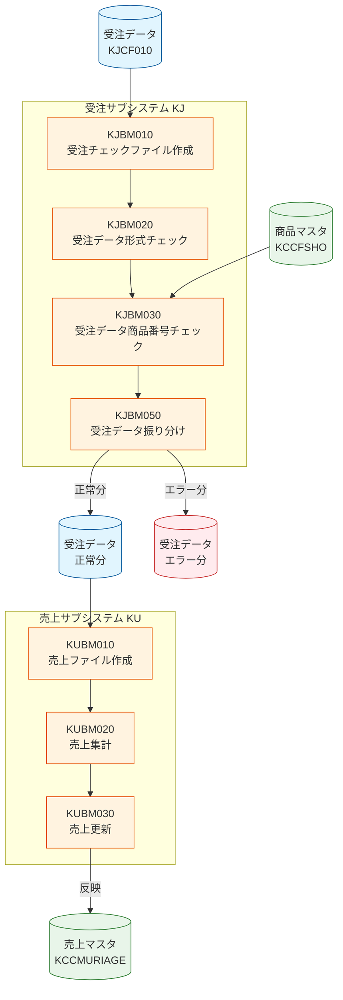

# 表紙

| 項目           | 内容                   |
| -------------- | ---------------------- |
| **システム名** | 研修 (ID: K)           |

## ガイドライン

| ドキュメント              | 説明                                   |
| ------------------------- | -------------------------------------- |
| [RULES.md](RULES.md)      | 実習ルール、コーディング規則、命名規則 |

---

## ジョブフロー

| ドキュメント                      | ジョブ名         | 説明                                                     |
| --------------------------------- | ---------------- | -------------------------------------------------------- |
| [FLOW_KJJD010.md](FLOW_KJJD010.md) | 受注データ更新   | 受注データチェックから売上更新までの一連の処理フロー     |
| [JOB_KJJD010.md](JOB_KJJD010.md)  | 受注データ更新   | JOBフロースクリプト設計書（スクリプト構造・テストデータ・検証期待値）|

---

## プログラム仕様書

### 受注サブシステム (KJ)

| ドキュメント                      | プログラムID | プログラム名               | 種別     |
| --------------------------------- | ------------ | -------------------------- | -------- |
| [PRG_KJBM010.md](PRG_KJBM010.md)  | KJBM010      | 受注チェックファイル作成   | MAIN/BAT |
| [PRG_KJBM020.md](PRG_KJBM020.md)  | KJBM020      | 受注データ形式チェック     | MAIN/BAT |
| [PRG_KJBM030.md](PRG_KJBM030.md)  | KJBM030      | 受注データ商品番号チェック | MAIN/BAT |
| [PRG_KJBM050.md](PRG_KJBM050.md)  | KJBM050      | 受注データ振り分け         | MAIN/BAT |

### 売上サブシステム (KU)

| ドキュメント                      | プログラムID | プログラム名     | 種別     |
| --------------------------------- | ------------ | ---------------- | -------- |
| [PRG_KUBM010.md](PRG_KUBM010.md)  | KUBM010      | 売上ファイル作成 | MAIN/BAT |
| [PRG_KUBM020.md](PRG_KUBM020.md)  | KUBM020      | 売上集計         | MAIN/BAT |
| [PRG_KUBM030.md](PRG_KUBM030.md)  | KUBM030      | 売上更新         | MAIN/BAT |

---

## サブプログラム仕様書

| ドキュメント                      | プログラムID | プログラム名   | コピー句ID |
| --------------------------------- | ------------ | -------------- | ---------- |
| [SUB_KCBS010.md](SUB_KCBS010.md)  | KCBS010      | 日付チェック   | KCBS010P   |

---

## ユーティリティ

| ドキュメント | ツール名 | 説明 |
| ------------ | -------- | ---- |
| [UTIL_GCSORT.md](UTIL_GCSORT.md) | GCSORT | ソートユーティリティ（MFSORTサブセット） |

---

## ファイル定義書

### ファイル定義: 受注サブシステム (KJ)

| ドキュメント                    | コピー句ID | ファイル名           | ファイル編成       |
| ------------------------------- | ---------- | -------------------- | ------------------ |
| [FF_KJCF010.md](FF_KJCF010.md)  | KJCF010    | 受注データ           | 行順編成   |
| [FF_KJCF020.md](FF_KJCF020.md)  | KJCF020    | 受注チェックファイル | 順編成     |

### ファイル定義: 売上サブシステム (KU)

| ドキュメント                    | コピー句ID | ファイル名       | ファイル編成     |
| ------------------------------- | ---------- | ---------------- | ---------------- |
| [FF_KUCF010.md](FF_KUCF010.md)  | KUCF010    | 売上ファイル     | 順編成   |
| [FF_KUCF020.md](FF_KUCF020.md)  | KUCF020    | 売上集計ファイル | 順編成   |

### ファイル定義: 共通サブシステム (KC)

| ドキュメント                    | コピー句ID | ファイル名       | ファイル編成     |
| ------------------------------- | ---------- | ---------------- | ---------------- |
| [FF_KCCFSHO.md](FF_KCCFSHO.md)  | KCCFSHO    | 商品マスタSAM    | 順編成   |

---

## テーブル定義書

| ドキュメント                          | テーブル名   | 論理テーブル名 |
| ------------------------------------- | ------------ | -------------- |
| [TBL_KCCMURIAGE.md](TBL_KCCMURIAGE.md) | KCCMURIAGE   | 売上マスタ     |

---

## サブシステム一覧

| サブシステムID | サブシステム名 | 説明             |
| -------------- | -------------- | ---------------- |
| KJ             | 受注           | 受注処理         |
| KU             | 売上           | 売上処理         |
| KC             | 共通           | 共通処理・マスタ |

---

## 処理フロー概要

